# Islandify

Islandify는 사용자의 현재 시간 기반 활동을 iPhone 앱과 Dynamic Island, 잠금 화면 Live Activity에서 한눈에 보여주는 로컬 우선 iOS 앱입니다. 타이머, 여행 D-day, 관계 D+, 러닝을 하나의 활동 모델로 다루며, 시스템이 제공하는 Live Activity 영역 안에서 glanceable한 정보를 제공합니다.

모든 핵심 상태는 기기에 저장하고 절대 날짜·시각을 기준으로 다시 계산합니다. 따라서 앱이 백그라운드로 전환되거나 일시 중단되어도 타이머와 활동 상태를 복원할 수 있습니다.

## 지원 기능

- **Timer**: 일시정지·재개·1분 추가를 지원하는 카운트다운
- **Travel**: 목적지와 타임존을 반영한 출발 D-day
- **Together**: 관계 시작일 기준 D+ 카운터, 기념일, 선택적 알림
- **Run**: 위치 기반 거리·페이스·칼로리 추정과 시간만 사용하는 fallback
- **Style**: Dynamic Island의 고정 시스템 슬롯에 맞춘 테마·표시 구성

## 프로젝트 구조

아래 다이어그램은 버전 관리 대상 소스와 프로젝트 설정을 기준으로 정리한 현재 구조입니다. 로컬 IDE 메타데이터인 `.idea/`는 포함하지 않습니다.

```mermaid
flowchart TD
    root["Islandify/"]

    root --> xcode["Islandify.xcodeproj/"]
    xcode --> pbx["project.pbxproj<br/>앱·위젯·테스트 타깃"]
    xcode --> workspace["project.xcworkspace/<br/>공유 Islandify scheme"]

    root --> app["Islandify/<br/>iOS 앱 타깃"]
    app --> appLayer["App/"]
    appLayer --> appEntry["IslandifyApp.swift<br/>앱 진입점"]
    appLayer --> content["ContentView.swift<br/>Timer·Travel·Together·Run·Style 탭"]
    appLayer --> model["IslandifyAppModel.swift<br/>앱 상태·영속성·Activity 연결"]
    appLayer --> timerView["TimerFeatureView.swift"]
    appLayer --> travelView["TravelFeatureView.swift"]
    appLayer --> relationshipView["RelationshipFeatureView.swift"]
    appLayer --> runningView["RunningFeatureView.swift"]
    appLayer --> customizationView["CustomizationFeatureView.swift"]
    app --> services["Services/"]
    services --> activityManager["LiveActivityManager.swift<br/>ActivityKit lifecycle"]
    services --> notifications["LocalNotificationScheduler.swift<br/>UserNotifications"]
    services --> location["LocationService.swift<br/>Core Location"]
    app --> resources["Resources/"]
    resources --> appInfo["Info.plist"]
    resources --> entitlements["Islandify.entitlements"]

    root --> widget["IslandifyWidget/<br/>WidgetKit extension"]
    widget --> widgetBundle["IslandifyWidgetBundle.swift"]
    widget --> liveActivity["IslandifyLiveActivityWidget.swift<br/>Dynamic Island·Lock Screen UI"]
    widget --> widgetInfo["Info.plist"]

    root --> shared["Shared/<br/>앱·위젯 공용 소스"]
    shared --> contracts["ActivityContracts/"]
    contracts --> attributes["IslandifyActivityAttributes.swift<br/>ActivityAttributes·ContentState"]
    shared --> domain["Domain/"]
    domain --> coreDomain["TimerDomain.swift<br/>TravelDomain.swift<br/>RelationshipDomain.swift<br/>RunningDomain.swift"]
    domain --> presentationDomain["ActivityPresentation.swift<br/>CustomizationDomain.swift<br/>TravelPresentation.swift"]
    domain --> utilities["DateMath.swift<br/>TimeFormatting.swift<br/>LocalStore.swift<br/>PreviewData.swift"]
    shared --> checks["DomainChecks/main.swift<br/>독립 도메인 점검 실행 파일"]

    root --> tests["IslandifyTests/<br/>XCTest 단위 테스트"]
    tests --> testFiles["Timer·Travel·Relationship·Running<br/>Customization·Presentation·LocalStore·Stability"]

    root --> package["Package.swift<br/>도메인 라이브러리·점검·테스트"]
    root --> tooling["프로젝트 작업 설정"]
    tooling --> agents[".agents/skills/islandify-ios/"]
    tooling --> codex[".codex/<br/>agents·hooks·rules·ticket"]
    root --> docs["AGENTS.md · LICENSE · README.md"]

    app -->|사용| shared
    widget -->|표시| contracts
    widget -->|렌더링 모델| domain
    tests -->|검증| domain
```



## 기술 스택

| 영역 | 기술 | 적용 내용 |
| --- | --- | --- |
| 언어 | Swift 5 | 앱·위젯·도메인 모델 구현 |
| 앱 UI | SwiftUI | iOS 앱 화면과 기능별 입력·상태 화면 |
| Live Activity | ActivityKit | 활동 시작·갱신·종료와 공유 `ActivityAttributes` |
| 위젯 UI | WidgetKit | Dynamic Island의 compact·minimal·expanded 및 잠금 화면 UI |
| 로컬 알림 | UserNotifications | 관계 기념일 알림 예약·취소 |
| 위치 | Core Location | 러닝 중 거리와 페이스 추정, 권한 거부 시 시간 기반 fallback |
| 저장소 | Foundation 기반 로컬 JSON | `JSONLocalStore`를 통한 기기 내 상태 저장·마이그레이션 |
| 테스트 | XCTest + Swift Package Manager | 순수 도메인 단위 테스트와 독립 실행형 도메인 점검 |
| 빌드 | Xcode project + Swift Package Manager | iOS deployment target 16.1, 도메인 패키지 테스트 구성 |

## 아키텍처 원칙

- 앱 화면은 SwiftUI로 구성하고, Live Activity 표현은 WidgetKit의 시스템 제공 영역만 사용합니다.
- 앱과 위젯이 공유하는 ActivityKit 계약은 `Shared/ActivityContracts`에 둡니다.
- 타이머·D-day·러닝 계산은 `Shared/Domain`의 순수 모델과 계산기로 분리합니다.
- 활동의 기준 시각은 메모리의 반복 타이머가 아니라 저장된 절대 날짜·시각입니다.
- 첫 릴리스 데이터는 기기에만 저장하며 계정·서버·네트워크·HealthKit·Watch 연동은 포함하지 않습니다.

## 검증 및 실행

도메인 로직은 Swift Package Manager로 빠르게 검증할 수 있습니다.

```sh
swift test
swift run IslandifyDomainChecks
```

Xcode에서 앱 타깃과 테스트를 검증하려면 다음 명령을 사용합니다.

```sh
xcodebuild -project Islandify.xcodeproj \
  -scheme Islandify \
  -sdk iphonesimulator \
  -configuration Debug build

xcodebuild test \
  -project Islandify.xcodeproj \
  -scheme Islandify \
  -destination 'platform=iOS Simulator,name=iPhone 16'
```
